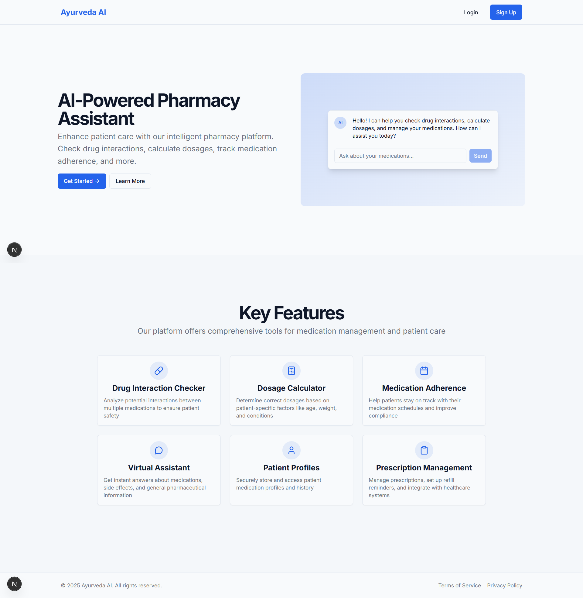

# AyurVeda - Medication Management System

AyurVeda is a comprehensive medication management application built with Next.js, helping users track their medications, check for drug interactions, and maintain proper adherence to their treatment plans. The platform combines AI-powered assistance with powerful medication management tools to enhance patient care.

## Application Screenshots

### Landing Page

*The AyurVeda welcome page showcasing the AI-Powered Pharmacy Assistant with an interactive chat interface. The landing page highlights key features including drug interaction checking, dosage calculation, and medication adherence tracking.*

### User Authentication

#### Registration

*New users can create an account by providing their name, email, and password. The clean, minimalist registration form ensures a smooth onboarding experience.*

#### Login

*Returning users can securely sign in using their email and password. The login page maintains the same clean design principles as the registration page.*

### Main Dashboard

*The comprehensive dashboard provides an overview of the user's medication schedule, adherence statistics, and upcoming doses. Users can quickly access all key features from the sidebar navigation.*

### Medication Management

*The medications page allows users to view, add, edit, and delete medications with detailed information including dosage, frequency, and special instructions. The interface uses a clean card-based layout for easy scanning of medication details.*

### Medication Adherence Tracking

*The adherence tracking feature helps patients stay on schedule with their medications by providing visual reminders and progress tracking. Users can log when they've taken their medications and view historical adherence data.*

### Dosage Calculator

*The medication calculator provides precise dosage recommendations based on patient-specific factors such as weight, age, and kidney function. The calculator supports both adult and pediatric patients with specialized dosing algorithms.*

### Drug Interaction Checker

*The drug interaction tool analyzes potential interactions between multiple medications, alerting users to possible risks and providing severity ratings. The detailed information helps prevent adverse drug events before they occur.*

### AI Assistant

*The AI-powered virtual assistant provides instant answers about medications, potential side effects, and general pharmaceutical information. Users can ask questions in natural language and receive clear, accurate responses.*

### User Profile

*Users can manage their personal information, preferences, and account settings from the profile page. The interface provides easy access to privacy settings and notification preferences.*

### Application Settings

*The settings page allows users to customize their experience, including theme preferences, notification settings, and privacy controls. The intuitive interface makes it easy to configure the application according to user needs.*

### About AyurVeda

*The about page provides information about the AyurVeda platform, its mission, and the team behind it. Users can learn about how the platform works and the technologies used to deliver its features.*

### Workflow Overview

*This diagram illustrates how the different components of AyurVeda work together to provide a comprehensive medication management experience, from scheduling to adherence tracking to interaction checking.*

## Features

- **Medication Management**: Add, edit, view, and delete medications with detailed information
- **Interactive Dashboard**: View medication schedules, adherence rates, and upcoming doses
- **Drug Interaction Checker**: Check for potential drug interactions between medications
- **Adherence Tracking**: Track medication adherence with visual progress indicators
- **Medication Calculator**: Calculate precise dosages based on patient-specific factors
- **AI Virtual Assistant**: Get instant answers about medications and pharmaceutical information
- **User Authentication**: Secure login and registration system
- **Responsive Design**: Works on desktop, tablet, and mobile devices
- **User Profiles**: Manage personal information and preferences
- **Dark/Light Mode**: Choose between visual themes for comfortable viewing

## Tech Stack

- **Frontend**: Next.js, React, TypeScript, Tailwind CSS, shadcn/ui
- **Backend**: Next.js API Routes
- **Database**: SQLite with Prisma ORM
- **Authentication**: NextAuth.js
- **AI Integration**: Google Gemini API
- **Styling**: Tailwind CSS
- **State Management**: React Context API

## Getting Started

### Prerequisites

- Node.js 16.x or later
- npm or pnpm

### Installation

1. Clone the repository:
   ```bash
   git clone https://github.com/yourusername/ayurveda.git
   cd ayurveda
   ```

2. Install dependencies:
   ```bash
   npm install --legacy-peer-deps
   # or
   pnpm install
   ```

3. Create a `.env` file in the root directory with the following variables:
   ```
   # Database (SQLite - local file-based database)
   DATABASE_URL="file:./prisma/dev.db"

   # NextAuth
   NEXTAUTH_URL=http://localhost:3000
   NEXTAUTH_SECRET=your_nextauth_secret

   # API Keys
   GEMINI_API_KEY=your_gemini_api_key
   GOOGLE_CLIENT_ID=your_google_client_id
   GOOGLE_CLIENT_SECRET=your_google_client_secret
   ```

4. Set up the database:
   ```bash
   # Reset the database and apply migrations
   npm run db:reset
   ```

5. Start the development server:
   ```bash
   npm run dev
   ```

6. Open [http://localhost:3000](http://localhost:3000) in your browser to see the application.

## User Journey

AyurVeda provides a seamless experience for managing medications:

1. **Register/Login**: Create an account or sign in
2. **Dashboard**: View your medication schedule and adherence stats
3. **Add Medications**: Enter your current prescriptions with dosage details
4. **Check Interactions**: Verify that your medications are safe to take together
5. **Set Reminders**: Configure notifications for when to take each medication
6. **Track Adherence**: Log when you've taken each dose
7. **Calculate Dosages**: Use the calculator for precise medication amounts
8. **Ask the AI**: Get answers to any medication-related questions

## Database Management

This project uses SQLite, a file-based database that doesn't require a separate database server. The database file is stored at `prisma/dev.db` and is created automatically when you run the database setup commands.

- **Reset Database**: If you need to reset the database at any point:
  ```bash
  npm run db:reset
  ```

- **View Database**: To explore the database structure using Prisma Studio:
  ```bash
  npm run prisma:studio
  ```

## Project Structure

```
ayurveda/
├── app/                # Next.js app directory
│   ├── api/            # API routes
│   ├── dashboard/      # Dashboard routes
│   │   ├── calculator/ # Medication calculator
│   │   ├── medications/# Medication management
│   │   ├── profile/    # User profile
│   │   └── settings/   # Application settings
│   ├── login/          # Login page
│   ├── register/       # Registration page
│   ├── layout.tsx      # Root layout
│   └── page.tsx        # Home page
├── components/         # Reusable components
│   ├── ui/             # UI components
│   └── dashboard/      # Dashboard-specific components
├── docs/               # Documentation
│   └── screenshots/    # Application screenshots
├── lib/                # Utility functions
├── prisma/             # Prisma schema and migrations
│   ├── dev.db          # SQLite database file
│   ├── schema.prisma   # Database schema definition
│   └── migrations/     # Database migrations
├── public/             # Static assets
└── styles/             # Global styles
```

## Troubleshooting

### Common Issues

- **Database Errors**: If you encounter database-related errors, try resetting the database:
  ```bash
  npm run db:reset
  ```

- **Next.js Build Errors**: If you get build errors related to the .next directory:
  ```bash
  # Remove the .next directory and rebuild
  rm -rf .next
  npm run dev
  ```

- **Environment Variables**: Make sure all required environment variables are set in your .env file.

- **API Key Issues**: If the AI assistant isn't working, verify that your Gemini API key is correctly set in the .env file.

## API Routes

| Endpoint | Method | Description |
|----------|--------|-------------|
| `/api/auth/[...nextauth]` | GET/POST | Authentication endpoints |
| `/api/auth/register` | POST | User registration |
| `/api/medications` | GET | Get all medications for current user |
| `/api/medications` | POST | Create a new medication |
| `/api/medications/:id` | GET | Get a specific medication |
| `/api/medications/:id` | PUT | Update a medication |
| `/api/medications/:id` | DELETE | Delete a medication |
| `/api/adherence` | GET | Get adherence records |
| `/api/adherence` | POST | Create a new adherence record |
| `/api/interactions` | POST | Check for drug interactions |
| `/api/calculate` | POST | Calculate medication dosages |
| `/api/ai/assistant` | POST | Interact with the AI assistant |

## Performance Optimizations

1. **Context API with State Caching**: Used for efficient state management and to avoid prop drilling
2. **Memoization**: Optimized expensive calculations with useMemo and useCallback
3. **Code Splitting**: Implemented with Next.js dynamic imports
4. **API Response Caching**: Implemented with HTTP cache headers
5. **Image Optimization**: Using Next.js Image component
6. **Prefetching**: Key routes are prefetched for faster navigation

## Contributing

Contributions are welcome! Please feel free to submit a Pull Request.

## License

This project is licensed under the MIT License - see the LICENSE file for details.

## Acknowledgments

- [Next.js](https://nextjs.org/)
- [Prisma](https://www.prisma.io/)
- [Tailwind CSS](https://tailwindcss.com/)
- [shadcn/ui](https://ui.shadcn.com/)
- [Lucide Icons](https://lucide.dev/)
- [Google Gemini API](https://ai.google.dev/)

## Important Notes About SQLite

- SQLite is a file-based database that works well for development and small applications
- The database file is stored at `prisma/dev.db`
- All data is stored locally on your machine
- This approach is suitable for:
  - Development environments
  - Personal projects
  - Small-scale applications
  - Demonstrations

- For production applications that need to handle significant user load, consider:
  - Migrating to a more robust database like PostgreSQL
  - Using a managed database service (Neon, Supabase, etc.) 